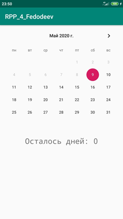
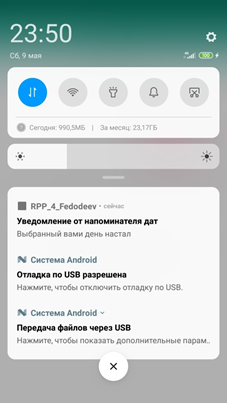

# RPP_4
В данной лабораторной работе требуется реализовать виджет, показывающий количество дней до установленной пользователем даты в приложении, а также присылать уведомление о том, что дата наступила.

Данное приложение состоит из трех классов. В главном классе приложения прописываются основные переменные для работы со временем, уведомлением, виджетом и самим календарем. В MainActivity через слушатель нажатия на элемент календаря высчитывается дата срабатывания alarmManager-a и передается нужная информация в виджет. Второй класс, myAppWidgetProvider служит для обновления данных на виджете, а именно, дней до срабатывания уведомления. Третий класс, ShowData, предназначен для показа уведомления.

# Скриншоты программы

Активити с выбором дат

Получение уведомления

Отображение виджета

